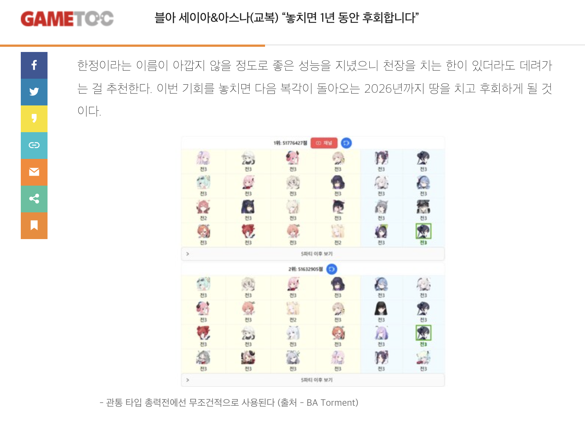
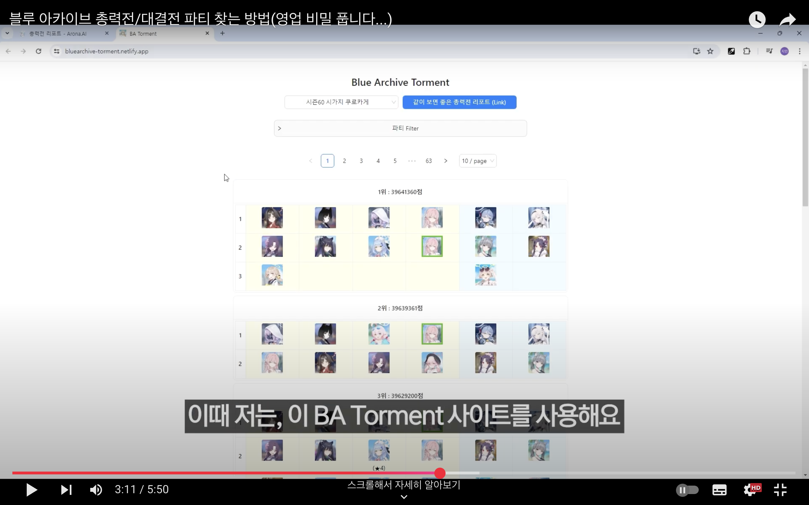
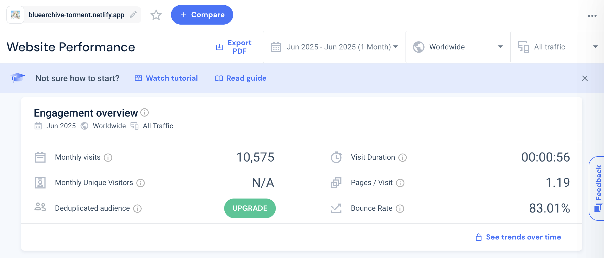

<p align="center">
  <a href="https://github.com/BeaverHouse/bluearchive-torment-front">
    
  </a>

  <p align="center">
    BA Torment : 블루아카이브 토먼트 파티찾기 도우미
    <br>
    <br>
    <a href="https://bluearchive-torment.netlify.app/"><strong>View the website »</strong></a>
    <br>
    <br>
    <a href="https://github.com/BeaverHouse/bluearchive-torment-front/issues">Bug Report</a>
    |
    <a href="https://github.com/BeaverHouse/bluearchive-torment-front/issues">Request to HU-Lee</a>
  </p>

  <p align="center">
    <a href="https://react.dev/">
      
    </a>
    <a href="https://developer.mozilla.org/ko/docs/Web/JavaScript">
      
    </a>
    <a href="https://eslint.org/">
      
    </a>
    <a href="https://yarnpkg.com/">
      
    </a>
    <a href="./LICENSE">
      
    </a>
  </p>
</p>

<!-- Content -->

## ❌ End of Service

안녕하세요. BA Torment 개발자입니다.  
처음 사이트를 개발한지 2년 정도가 되었네요.

다른 곳에도 글을 올리긴 했지만, BA Torment 서비스는 더 이상 업데이트가 되지 않을 예정입니다.

BA Torment 사이트는 다른 분들이 작업한 데이터를 2차 가공해서 사용하여 파티 정보를 제공하는 사이트였습니다.  
하지만 최근 데이터 소스가 더 이상 업데이트되지 않거나 접근할 수 없게 되었습니다.

다른 방안도 고민해 보았지만 공수가 너무 컸고 결국 더 이상 사이트를 유지할 수 없다는 결론을 내렸습니다.

현재 대결전 S23까지 있는 데이터는 그대로 조회 가능합니다. 한국 서버 기준 10~11월까지는 문제가 없을 거라 생각됩니다.  
하지만 그 이후의 데이터는 더 이상 업데이트가 되지 않을 예정입니다. 사이트 코드도 약간의 정리 후 아카이브 예정입니다.

앞으로의 계획은 잘 모르겠는데, 기회가 된다면 돌아오겠습니다.  
그 동안 부족한 사이트 많이 사용해 주셔서 감사합니다.

<details>
  <summary>그동안의 기록들</summary>
  
  
  
  
  
</details>

<br>

## Description

**❗❗This app is KOREAN Only.❗❗**

블루아카이브 토먼트 파티찾기 프론트엔드 코드입니다.  
JavaScript로 작성되었습니다.

파티 데이터는 Python을 통해 처리해서 JSON 형태로 사용하고 있습니다.  
업데이트 주기가 2주당 1번 정도이기 때문에, 따로 서버는 구축하지 않았습니다.

[BeaverHouse/bluearchive-torment-parse](https://github.com/BeaverHouse/bluearchive-torment-parse)

<br>

## Work

| 날짜    | 패치 내역                            |
| ------- | ------------------------------------ |
| 2023.07 | 사이트 오픈                          |
| 2023.11 | UI, 모바일 환경 최적화 작업          |
| 2024.03 | 전용무기 정보 표기 (일본 서버 S63 ~) |

<br>

## On local environment

**Install dependencies**

```
yarn install
```

**Run on local environment**

```
yarn start
```

<br>

## Contributing

See the [CONTRIBUTING.md][contributing].

[contributing]: ./CONTRIBUTING.md
